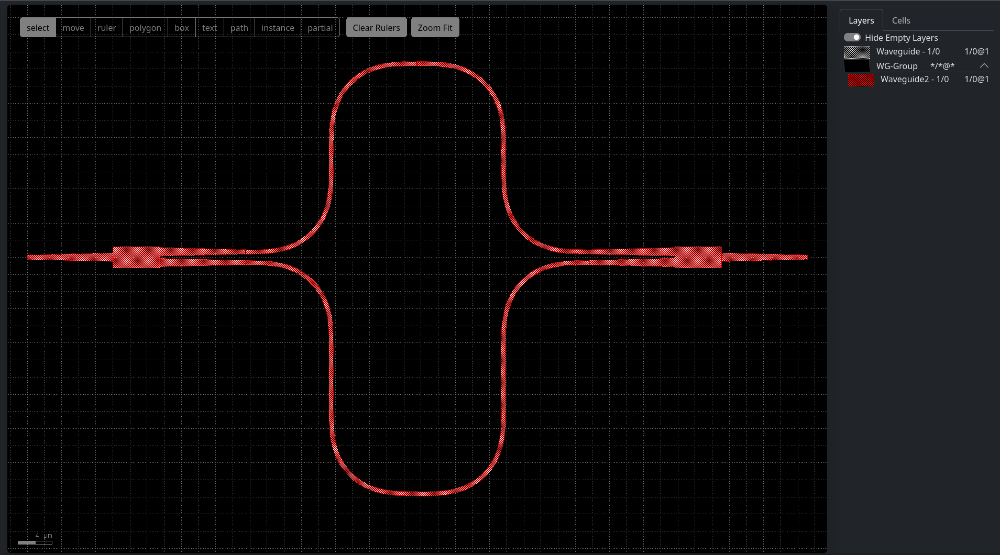

# kweb 1.1.9

KLayout Web Viewer 

Based on https://github.com/klayoutmatthias/canvas2canvas

## Install & Run

### Through pypi

From a python virtual environment run:

```bash
python -m pip install kweb
export KWEB_FILESLOCATION="/path/to/gds/folder" # or the windows equivalent with set
uvicorn --reload kweb.default:app
````

#### Advanced Usage

KWeb offers two basic apps:

- Browser:

  A version that provides a version with a file browser for a folder and the kweb viewer for viewing the gds file in that folder.
  This can be used by importing the funciton `kweb.browser.get_app` and settings the `KWEB_FILESLOCATION` env variable of passing
  `fileslocation=<Path object for target folder>` to the function. Alternatively there is a default one in `kweb.default.app` that
  will only look for the env variable.

- Viewer:

  Only enables the `/gds/<filename>` endpoints, no root path, i.e. no file browser. Available at `kweb.viewer.get_app`. This version
  doesn't provide a listener for the env variable. Use the `fileslocation` parameter in the function instead.

### Development

#### Clone & Installl


```bash
# Clone the repository to your local
git clone https://github.com/gdsfactory/kweb.git
# Install the necessary dependecies
cd /kweb
python -m pip install -e .[dev]
```

#### Set a folder for kweb to use when looking for gds files

```bash
export KWEB_FILESLOCATION=/path/to/folder/with/gdsfiles
```

#### Run

```bash
cd src/kweb
uvicorn --reload default:app
```

Copy the link http://127.0.0.1:8000/gds/file.gds (or http://localhost:8000/gds/file.gds also works) to your browser to open the waveguide example


#### Contributing

Pleas make sure you have also installed pre-commit before committing:

```bash
python -m pip install pre-commit
pre-commit install
```
